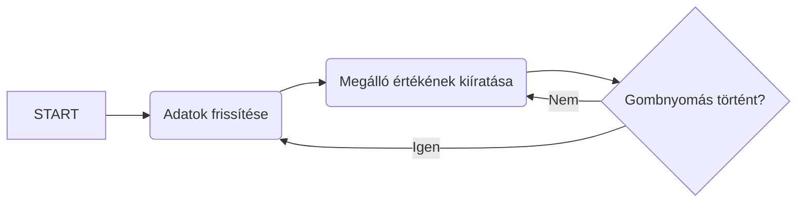

# E-FUTÁR 
**Beágyazott BKK Futár port ESP32 SoC-ra SSD1306 OLED kijelzővel, Arduino fejlesztőkörnyezetben**

Írta: Márkus Balázs

*This repository contains an embedded online bus tracking software that is only useful in Budapest, Hungary - so the documentation is written in Hungarian as well. Thanks for understanding!*

A program segítségével a mikrokontroller egy OLED kijelzőre kiírja az adott megállóból induló következő buszokat, és indulásig hátralévő idejüket, valamint az aktuális időt. A program több megállót is képes kezelni, ezek között a fejlesztőkártya beépített gombjával válthatunk, a loading állapotot a beépített fehér SMD LED jelzi.

## Használat, screenshotok
**Boot képernyő**

**Busz lista**

A program a fejlesztőkártya áram alá helyezése után azonnal elindul, felcsatlakozik a felkonfigurált WiFi hálózatra (lásd a konfigurálás bekezdést), majd kijelzi az alapértelmezett buszmegállóból induló 3 következő buszt. A JSON parancs szerint a program csak a követező 60 percben induló buszokat vizsgálja. Amennyiben háromnál kevesebb buszt talál, úgy kettő, vagy egy sort jelenít meg, találat hiánya esetén pedig a "Nem található indulás 60 percen belül." hibaüzenetet jeleníti meg.

Az egyes buszmegállók között a fejlesztőkártya beépített gombjával (kékkel jelölve), vagy a hozzá tartozó GPIO pin megfelelő manipulálásával válthatunk. A gomb lenyomása esetén a kártyára integrált fehér LED (feketével jelölve) felvillanása jelzi a loading állapotot (ugyanis a módosított JSON request-re meg kell várni a válasz érkezését), sikeres megállóváltás esetén a LED elalszik, és az OLED kijelzőn megjelenik a másik megálló neve, és az induló járatok, az előző módok szerint.

A példaprogramba három darab megálló lett integrálva, ezek sorrendben: 
 - Pesterzsébet, Baross utca
 - Pesterzsébet, Városközpont
 - János utca

**A használatbavétel előtt a WiFi-hez szükséges SSID és pass, valamint a megállók listáját fel kell konfigurálni, ehhez lásd a "konfigurálás" bejegyzés tartalmát!**

## Működés

A program alapvetően egy megszakításokkal kiegészített Round Robin architektúrát követ, bonyolultabb architektúra használatára nem volt szükség. A megállók kijelzése pedig egy egyszerű állapotgép-modell alapján történik, ahol az aktuális állapotot mindig egy darab megálló testesíti meg.

A program bekapcsoláskor felcsatlakozik a WiFi hálózatra, majd adott időközönként HTTP requesteket küld a BKK FUTÁR szervere felé, ami egy szabványosított, úgynevezett JSON formátumú üzenetet küld vissza. Ez az üzenet minden információt tartalmaz, amire szükségünk van, ezért további parancsokkal a listát szűkíthetjük, 

> például ha csak a következő fél órában onduló buszok érdekelnek minket, a &minutesAfter=60 parancsot kell használnunk a lekérdezésben. 

A JSON szintaktikájáról itt olvasható több információ: https://www.json.org/ továbbá a használható parancsok listáját a BKK FUTÁR Apiary tartalmazza:  https://bkkfutar.docs.apiary.io/ 
Miután a program elküldte a parancsot, a JSON library segítségével a visszakapott hosszú stringből (a HTTP válasz) érthető, objektumokból álló, és feldolgozható JSON objektumrendszert hoz létre. (További információ az ArduinoJSON Library dokumentációjában)
A rendszeresített adathalmazból ezután különböző stringmanipulátor függvényekkel, és grafikus feldolgozó metódusokkal kiíratjuk a kijelzőre az induló buszokat, valamint a megálló nevét. További extra, hogy a program a jelenlegi időt is megjeleníti, ugyanis a BKK FUTÁR API az UNIX epoch időt is leküldi, így egy téli/nyári változó beállításával egy egyszerű függvénnyel kiszámolható a pontos idő. 
A mikrovezérlő a gombnyomáshoz társított interrupt hatására kigyújtja a jelző LED-et, és módosítja a megálló változójának értékét. Sikeres megállóváltás esetén a LED kialszik.

## Folyamatábra (mermaid)

A program egyszerűsített működése grafikusan:

## A fejlesztőpanel

A program az ESP32 SoC-on alapuló, Heltec Automation által gyártott WIFI-LoRa-32 fejlesztőkártyán íródott, és tesztelődött, de adott esetben bármilyen Arduino-kompatibilis mikrokontrollerre átültethető, ugyanis a fejlesztés során a szabványos SSD1306, és WiFi könyvtárak voltak használva.

 

A program natívan, közvetlenül a panelen futtatható, egyéb alkatrészekre, és kábelekre nincs szükség.

## Fejlesztőkörnyezet
A fejlesztés a nyílt forráskódú **Arduino IDE 1.6.9**-es verziójában történt.
A fejlesztőkörnyezet letölthető innen:
https://www.arduino.cc/en/Main/Software
A sikeres compile-hoz szükséges a hardware library fájlok installálása is, melyek menete, és a hozzávaló fájlok az alábbi repository-ban találhatóak meg (lásd az Installation Guide-ot): 
https://github.com/Heltec-Aaron-Lee/WiFi_Kit_series

A driverek sikeres installálása után az Arduino IDE alaplapkezelőjében megjelenik a WIFI_LoRa_32 nevű board, ezt kell kiválasztanunk, majd a szokásos módszerrel lefordítani, és feltölteni a kódot.

## Konfigurálás
**1) WiFi felkonfigurálása**

A kód feltöltése előtt a saját SSID és jelszó beállítandó az ssid és pass globális változókban:

	char ssid[] = "SSID"; //  your network SSID (name)
	char pass[] = "Pass";    // your network password (use for WPA, or use as key for WEP)

**2) Megállók felkonfigurálása**

*Bevezető: A BKK FUTÁR rendszerében minden megállónak egyedi azonosítója van, melyek alapján a BKK FUTÁR API-ban, JSON formátumban lekérdezhető szinte minden fontos adat egy adott megállóról, vagy viszonylatról. Ennek pontos metodikájáról az alábbi, félhivatalos apiary-dokumentációban lehet olvasni: https://bkkfutar.docs.apiary.io/
A megállók kódjának kiderítésére egy egyszerű, térképes forma a BKK FUTÁR webes oldala, ahol egy adott megállóra kattintva, majd ott egy tetszőleges járatot kiválasztva a weboldal URL-jében megjelenik a kiválasztott megálló kódja (pl. Pesterzsébet, Baross utca esetén: F04144)
Az oldal elérhető itt: http://futar.bkk.hu/*

A megállók váltása a megallo globális változó állításával, majd a setStop függvény meghívásával történik, melynek hatására a következő lekérdezési ciklusban már az új megálló kódjával fogja küldeni a lekérdezést a szerver felé a mikrokontroller. Így a kívánt megálló kódjának megszerzése után, csupán a JSON request értékét kell módosítanunk:

	if(megallo==Baross) {
        stopName = "Baross utca";
        resource = "/bkk-utvonaltervezo-api/ws/otp/api/where/arrivals-and-departures-for-stop.json?stopId=BKK_F04144&onlyDepartures=onlyDepartures&limit=10&minutesBefore=0&minutesAfter=60";                    // http resource
    }
Ne feledjük az alapértelmezett megállóérték megadását sem, ezt a globális változó létrehozásakor elsőként megadott érték jelenti!

	char* stopName = "Baross utca";
	char* resource = "/bkk-utvonaltervezo-api/ws/otp/api/where/arrivals-and-departures-for-stop.json?stopId=BKK_F04144&onlyDepartures=onlyDepartures&limit=10&minutesBefore=0&minutesAfter=60";                    // http resource

**A műveletek elvégzése után a program a kártyára feltölthetővé válik.**

## Könyvtárak

A fejlesztés során a következő könyvtárak voltak használva:

Arduino WiFi Library - a csatlakozáshoz

https://github.com/arduino/Arduino/tree/master/libraries/WiFi

Adafruit SSD1306 Library - a kijelző vezérléséhez

https://github.com/adafruit/Adafruit_SSD1306

ArduinoJSON Library - a http válasz parse-olásához

https://github.com/bblanchon/ArduinoJson

## Fejlesztési lehetőségek

 - kliensalkalmazás a WiFi felkonfigurálására
 - kliensalkalmazás a megállók felkonfigurálására
 - ébresztő hangjelzés buzzer segítségével egy adott buszjárathoz kötve
 - buszok menetrendi statisztikáinak, késéseinek online grafikus követése egy JavaScript alkalmazásban

## Források, és köszönet

A projektben nagy segítségemre volt Balássy György cikksorozata:

https://balassygyorgy.wordpress.com/2016/02/02/bkk-futar-microsoft-bandre-2-bkk-futar-api/

Valamint a BKK FUTÁR Apiary:

https://bkkfutar.docs.apiary.io/
